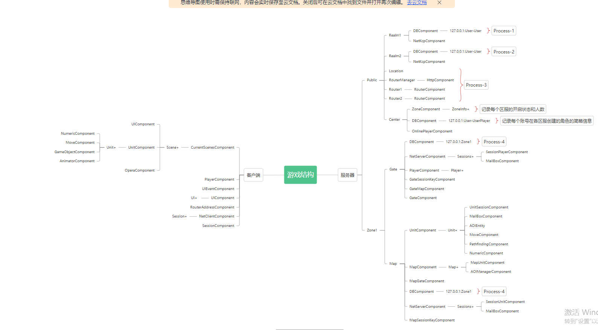
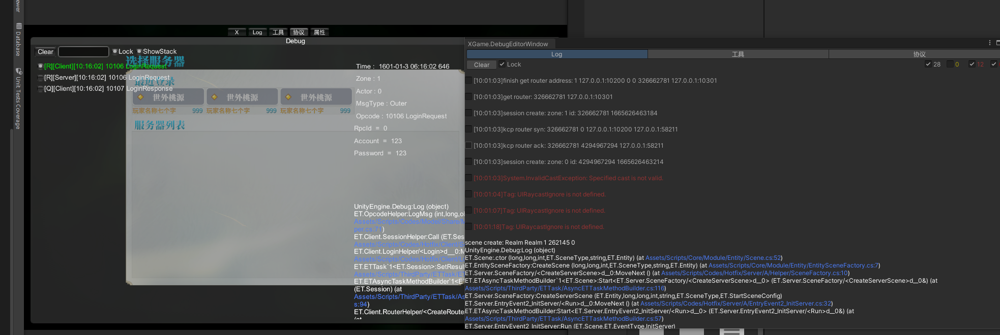
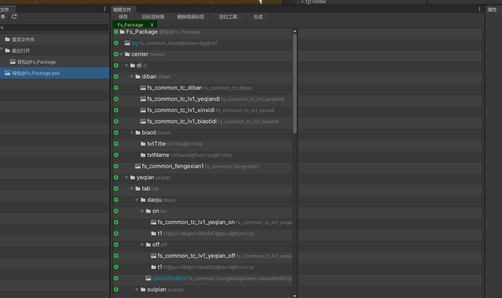
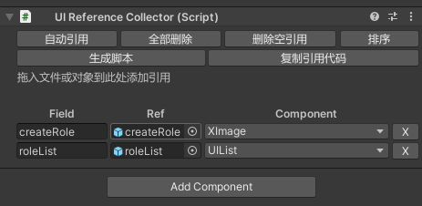

# UnityPlugins
ET版本 7.1 2022-10-07 20:48

因为数据库文件太大，调试工程需要增加数据库

## 框架内容上的修改
1.Excel和Proto路径  
2.使用BundleMaster代替AssetComponent  
3.本样例工程实现了登录、注册、创建角色、选择角色进入游戏几个功能，修改了逻辑部分结构。
脑图如下：

## 插件
### 1.ProtoBuf编辑器（Editor/ProtoBufEditor）

1.规定命名规范：采用(name) + (Request、Response、Message)的命名组合规则，对Actor类型消息
使用（name）+（ARequest、AResponse、AMessage），对ActorLocation则是（ALRequest）如此。  
2.选择消息类型，如果类型为Request类型，则点击类型旁边按钮一键创建（选择）关联的Response。  
3.当消息类型为None时，则该结构被是作为结构体，就会出现在字段类型选择中。如果要使用Unity中的类型
请勾选【UnityStruct】并填入类型名称，如果是非ET命名空间下的类型，请带上包名。  
4.支持迁移（M）克隆（C）删除（X）
### 2.Debug工具栏（ThirdParty/Console）

1.支持Runtime和Editor（快捷键F6）两种  
2.Log支持点击跳转到行  
3.协议工具使用OpcodeHelper.LogMsg自行接入。样例工程已经接好了，可以参考  
4.属性栏可以在Runtime中查看场景中的GameObject结构，能设置Active  
5.工具栏为一些操作扩展  
### 3.PSD2UGUI（Editor/PSD）

介绍请看[PSD2UGUI](https://blog.csdn.net/Sagacious_G/article/details/124145809)
### 4.UI

1.提供UIReferenceCollector代替ReferenceCollector，自动引用并指定引用GameObject的组件。  
2.在原ET的UI框架基础上升级。  
3.点击“生成脚本”可以生成Component，System，Event三大件，在对应的Ex文件下编辑额外逻辑。  
### 5.UGUI
1.提供一些UI的基础套件（UIList、Popup、PageScroll等）
### 6.ComponetView

1.改进了ComponentView可以查看所有属性和字段  
2.实现TypeDraw扩展更多类型  
3.支持Dictionary、list、stack
### 7.NumericTypeEditor

### 8.ETTreeViewr

